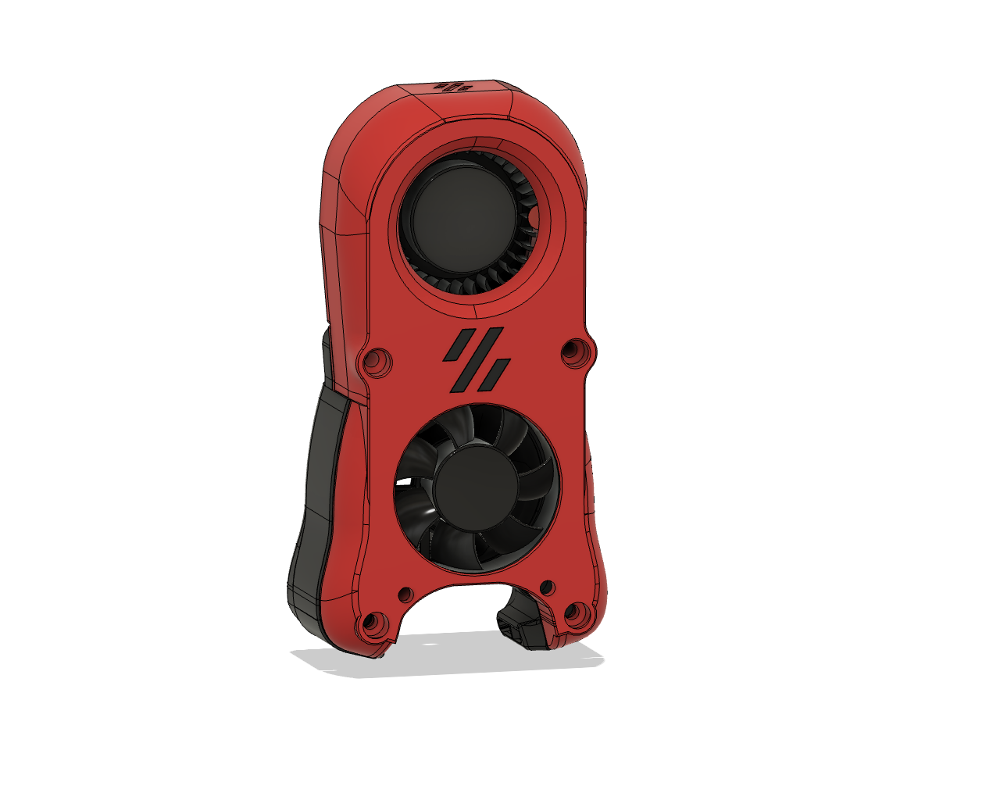

# AB-BN-30 Logo Mod

This is a small modification of [BadNoob's AB-BN](https://github.com/VoronDesign/VoronUsers/tree/master/printer_mods/Badnoob/AB-BN) hotend, replacing the wordmark on the front with the Voron logo or a plain front.

## BOM
Print either the `ab-bn-30-FAN-front-plain.stl` or `ab-bn-30-FAN-front-logo.stl` and appropriate inset piece. There are 3 available with difference tolerances (0.1mm - 0.3mm) to get a good fit.

Assembly is the exact same as the primary AB-BN, just use the new fan front part.

## Changelog

**2021-09-02**
- Increase z tolerance
- Flipped insets STL so smooth surface is forward facing, feel free to flip over if using ironing

**2021-09-01**
- Initial release