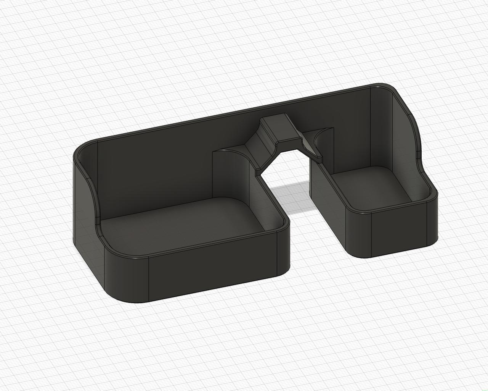

# Decontaminator Purge Bucket Mod



This is a small modification to the 300mm purge bucket by [edwardyeeks](https://github.com/edwardyeeks) to accomodate the bed Wagos. I've also increased the magnet spot size to make it less likely to crack when inserting magnets.

## BOM

Print `300mm.stl` purge bucket instead of the default. The right side bucket is slightly narrower to accomodate the bed Wagos.

## Macro Addition

I've also made a small change to the purge bucket selection changing it from simply random left or right, to picking a side based on their size (whicherver side is defined as wider will get used more).

Simply replace the below lines:

```
### Randomly select left or right bin for purge. 0 = left, 1 = right
SET_GCODE_VARIABLE MACRO=clean_nozzle VARIABLE=bucket_pos VALUE={(range(2) | random)}	
```

with these:

```
### Randomly select left or right bin for purge based on their width. 0 = left, 1 = right
 
 

 

    SET_GCODE_VARIABLE MACRO=clean_nozzle VARIABLE=bucket_pos VALUE=0

 

    SET_GCODE_VARIABLE MACRO=clean_nozzle VARIABLE=bucket_pos VALUE=1
 
 

```

Also ensure you've updated `variable_bucket_left_width` and `variable_bucket_right_width` to the correct values (default or otherwise).

Special thanks to Cyndane in the Discord as well.

## Changelog
2021-10-02
	- Added slightly modified purge bucket selection macro
2021-09-30
	- Initial release