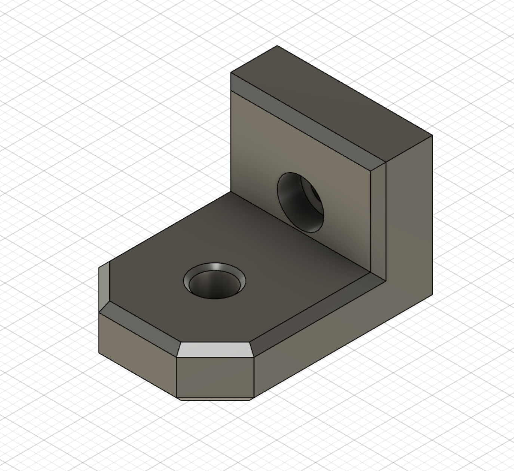

# Voron Mods

A collection of mods of mods for Voron 3D Printers. Checkout the main collection of mods at [VoronUsers](https://github.com/VoronDesign/VoronUsers).

## Mods of Mods

### AB-BN-30
> This is a small modification of [BadNoob's AB-BN](https://github.com/VoronDesign/VoronUsers/tree/master/printer_mods/Badnoob/AB-BN) hotend, replacing the wordmark on the front with the Voron logo or a plain front.

### Decontaminator Purge Bucket
> This is a small modification to the 300mm purge bucket by [edwardyeeks](https://github.com/edwardyeeks) to accomodate the bed Wagos. I've also increased the magnet spot size to make it less likely to crack when inserting magnets.

### Trident Bowden Guide
> This is a small modification to the original mod by [GalvanicGlaze](https://github.com/GalvanicGlaze/Voron_Mods/tree/main/Trident%20Bowden%20tube%20PTFE%20guide) to use a heatset insert and M3x8 screw.

