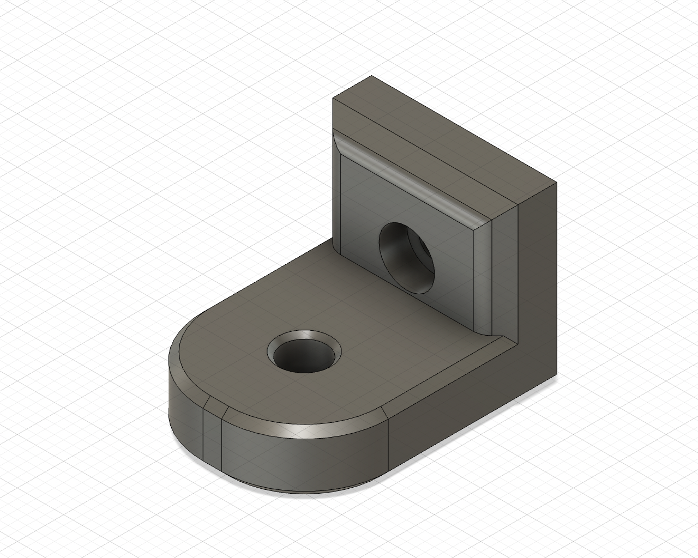

# PTFE bowden tube guide for Trident Mod

This is a small modification to the original mod by [GalvanicGlaze](https://github.com/GalvanicGlaze/Voron_Mods/tree/main/Trident%20Bowden%20tube%20PTFE%20guide) to use a heatset insert and M3x8 screw.

## BOM
- M3x8 Bolt x2 and M3 T-nut x1
- Optional 4mm drill bit for cleaning out bowden tube path

## Installation
- Optionally drill out bowden guide with 4mm drill bit for a better bowden tube fit
- Bolt mount to rear frame with M3x8 and tnut putting the lip at the top
- Screw arm on with M3x8 heatset, allowing the arm to still be able to swivel

## Changelog
2022-08-21
- Initial release
